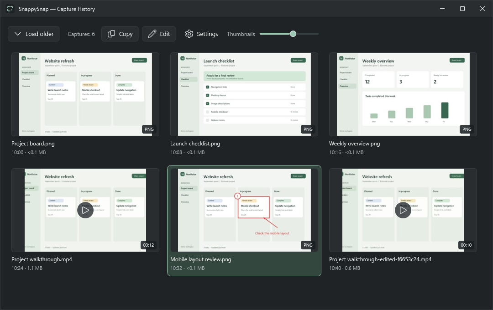
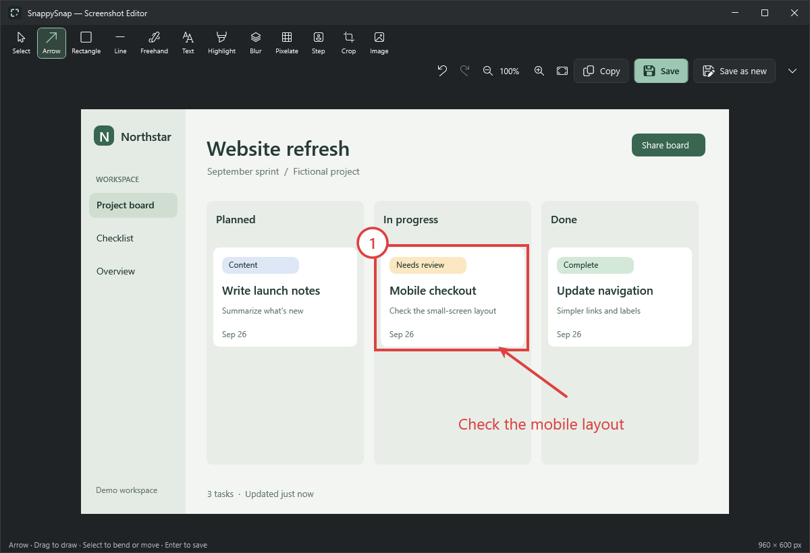
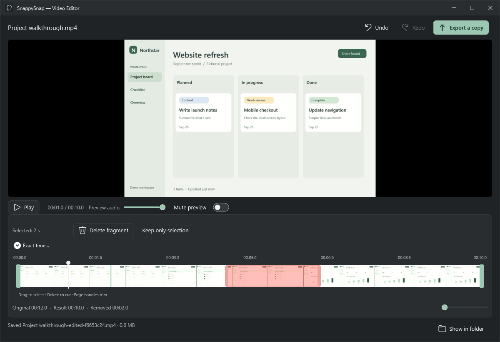

# SnappySnap

Capture, annotate, record, and edit your Windows 11 screen — with local-first storage and no cloud uploads.

[Windows installer](https://github.com/28thDev/SnappySnap/releases/latest) · [Build from source](docs/public/BUILDING.md) · [Privacy](docs/public/PRIVACY.md)

## What it does

- Capture a screen region, annotate it, crop it, copy it or save a separate version.
- Record a region as MP4/H.264 with pause/resume, mouse-click indicators, system audio and optional microphone audio.
- Trim recordings and remove middle sections, then export a new MP4 while preserving the original.
- Browse recent captures in Shelf/history, select several files and drag them into another application.
- Use English by default, with Russian, Simplified Chinese, Japanese and Spanish also available. System, Light or Dark appearance is also supported; theme changes preview immediately and Save keeps them.

No accounts, cloud uploads, online telemetry or separate capture application is required.

## See it in action

<p align="center">
  
</p>

<p align="center"><em>Keep recent screenshots and recordings together in the local Capture History.</em></p>

<table>
  <tr>
    <td width="50%" align="center">
      
      <br />Annotate, crop and save a screenshot.
    </td>
    <td width="50%" align="center">
      
      <br />Preview, trim and export a recording.
    </td>
  </tr>
</table>

These images show the real WPF interface with a fictional project board and local demonstration files. The annotations, history cards and video timeline use the application's own controls; no personal captures are included.

## Everyday controls

| Shortcut | Action |
| --- | --- |
| `Ctrl+E` | Select a screenshot region |
| `Ctrl+Alt+E` | Start or stop region recording |
| `Ctrl+Alt+Space` | Pause or resume recording |
| `Esc` | Cancel region selection |

Shortcuts can be changed in Settings. Conflicts with other applications are reported there. Click the tray icon to open recent captures; Settings is available directly from Shelf/history. A brief startup card shows your configured shortcuts.

Screenshot selection saves the original before opening the editor. **Copy** puts the current edit on the clipboard, **Save** replaces the saved screenshot, and **Save as new** keeps a separate copy. Dragging from history transfers the saved file, not unsaved editor changes.

## Installation and updates

Download `SnappySnap-Setup-<version>-x64.exe` from this repository's [GitHub Releases](https://github.com/28thDev/SnappySnap/releases). GitHub's “Source code” ZIP is not the installer.

- Windows 11 x64, build 22000 or later. Windows 10 and ARM64 are not supported targets.
- Setup installs for the current user and includes the .NET and required Microsoft C++ runtimes; administrator rights and online prerequisites are not required. On Windows N, an optional unchecked task opens Windows Optional Features when Media Foundation is missing so you can install the official Media Feature Pack.
- For a manual update, finish recording/export, resolve editor changes and exit SnappySnap from the tray. Run the new Setup over the existing installation.
- Uninstall keeps captures and profile data. Delete in Shelf removes the selected media files.
- The 1.0.0 installer has no Authenticode publisher signature. Windows may show an unknown-publisher or reputation warning. The update catalog is cryptographically signed; this is separate from Windows publisher signing.

Settings can check official stable GitHub Releases automatically, or you can choose **Check now**. A verified new version appears in Settings and Shelf; choose **Download**, then **Update and restart**. Automatic checks can be disabled. Network failures are quiet and an already downloaded installer can be used offline after local verification.

## Files and privacy

Media defaults to `%USERPROFILE%\Pictures\SnappySnap\YYYY-MM\`. Settings/history/logs are local under `%LOCALAPPDATA%\SnappySnap`. Read the [privacy and data-retention notes](docs/public/PRIVACY.md) before sharing diagnostic files.

## Development

```powershell
dotnet restore SnappySnap.sln --locked-mode
./build.ps1 -Configuration Release
./test.ps1 -Configuration Release -NoBuild
```

The SDK and NuGet dependency graph are pinned. [Build instructions](docs/public/BUILDING.md) cover the installer and Windows acceptance. [Contributing](CONTRIBUTING.md) describes development on `master` with temporary feature branches; [release preparation](docs/public/RELEASE_PROCESS.md) explains tags, optional release branches and publication gates.

## Status and license

See [CHANGELOG.md](CHANGELOG.md) for release changes and the [release notes](docs/public/releases/1.0.0.md) for installation requirements.

SnappySnap is released under the [MIT License](LICENSE). Third-party components retain their own licenses; see [dependencies and notices](docs/DEPENDENCIES.md). Security reports follow [SECURITY.md](SECURITY.md).
