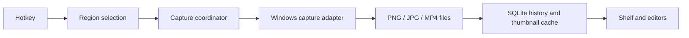

# Architecture

SnappySnap is a native Windows 11 x64 application built with C#, .NET 10 and WPF. The application process owns capture, windows and local history. A separate update helper handles installer handoff so the installed application can exit before its files are replaced. There is no web runtime, server, account system or telemetry service.

## Boundaries

| Project | Responsibility |
| --- | --- |
| Core | Domain types, explicit physical-screen geometry, state rules and managed interfaces |
| Application | Screenshot/recording coordinators, history use cases, exit and update orchestration |
| Capture | Windows Graphics Capture/D3D11 and the ScreenRecorderLib adapter; monitor topology, input hooks and capture exclusion |
| Editor | Screenshot document, commands, undo/redo, rendering and annotation window |
| History | SQLite history and thumbnail workflows |
| Infrastructure | Files, JSON settings, logging, startup integration, Windows video preview/export and update-process launch |
| Updates | Shared catalog/signature/package validation, GitHub Releases transport and persisted check schedule |
| UpdateHost | Independent process for safe application exit, Setup execution and restart |
| App | WPF windows, tray, Shelf, video editor and composition root |

The UI must call SnappySnap-owned contracts, not ScreenRecorderLib directly. Core contracts must not expose SQLite entities, WPF view models or recorder types. Capture state belongs to coordinators, not button state. New features should fit these boundaries; release preparation does not require another framework or a module split.

## Capture and storage

Screen coordinates are physical virtual-desktop pixels, including negative origins. Capture plans convert explicitly between monitor-local pixels and window DIPs. Mixed-DPI correctness requires real Windows acceptance in addition to transform tests.

Media is stored as ordinary files. JSON preferences and SQLite metadata live in the user's local application-data directory. File export uses the existing atomic-save path. Screenshot editing supports replacement or a new copy; precise video editing creates a separate MP4 and preserves the original. Encoder, disk, database and thumbnail work stays off the WPF UI thread.

## Trust and distribution

- The production updater checks the fixed public GitHub Releases source. It validates the signed catalog and installer hash, retains a verified cache for offline installation, and uses a persisted schedule to avoid repeated requests during outages. The local-folder transport is limited to isolated tests.
- The committed `release-public.pem` is a public verification key. The signing key is external to the repository and protected by Windows DPAPI. It is never a source file, installer asset or CI secret by default.
- Catalog signing and Windows Authenticode signing are different mechanisms. The former does not give Setup a verified Windows publisher.
- `Directory.Build.props` owns the product version; `global.json` pins the SDK feature band, and package lock files constrain NuGet restoration.
- A public source snapshot is separate from private development history. Installers are release assets, never Git blobs. See [release process](RELEASE_PROCESS.md).

## Verification boundaries

Automated tests cover state transitions, geometry, persistence, export safety, editor commands and update validation. CI builds/tests on Windows; it cannot certify external drag-and-drop, microphone behavior, overlay exclusion, driver compatibility or installation lifecycle. These are explicit release gates, not assumptions inferred from compilation.
